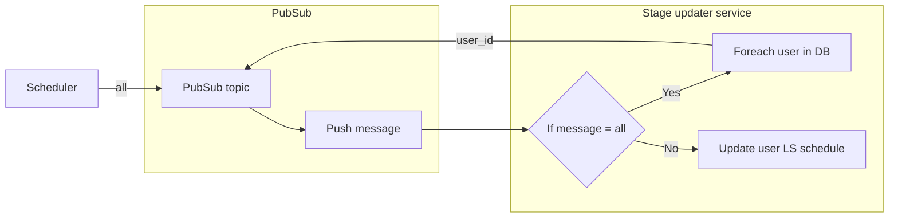

# eskomunplugged

## Description
The goal of this build was to develop a slack app that could be used to inform your colleagues when you have loadshedding - ideally by updating your Slack status when you have loadshedding.

We managed to develop a Slack app that allows a user to set their area by searching for their area (this uses the ESP area_search endpoint), or by searching using their GPS coordinates (this uses the ESP area_nearby endpoint).

The user loadshedding schedules can then be queried from the Slack bot to see when everyone in a workspace that has configured the Slack app, has loadshedding.

## Database
For the database we used Google Firestore to store Slack user IDs and their EskomSePush area information (area IS and stage information). The data is stored in teh following format:
```
{
    data format
}

```


## Slack app
TODO - JDM


## Stage updater backend

### Description
The stage updater updates a users loadshedding stage schedules and stores it in FireStore for the Slack app to use. The stage updater works by retrieving the area information for a user using the configured area_id for that user. The loadshedding stage information is retrieved using the /area_information endpoint and formatted and stored in FireStore.



### Tools used
For this part of the project we used:
- Python3 and various libraries like 
    - Flask
    - GCP dependencies
    - Our own ESP wrapper for Python
- Google Cloud Run
- Google Cloud Build
- Google Cloud Secret Manager
- Google Cloud Scheduler
- Google Cloud PubSub


## Improvements
For this project the focus was on delivering a minimum viable product for the Offerzen ESP build demo. As such, there are many improvements that can be made to this build.
- Feature: Add Slack status updates for users
- Bug: Fix Gooogle Code build deployment error (No module named 'main')
- Task: Overall improvements to code quality
